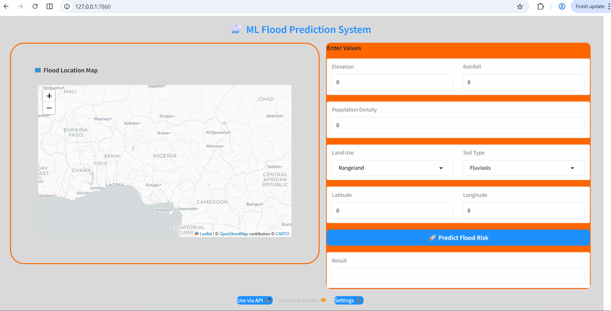
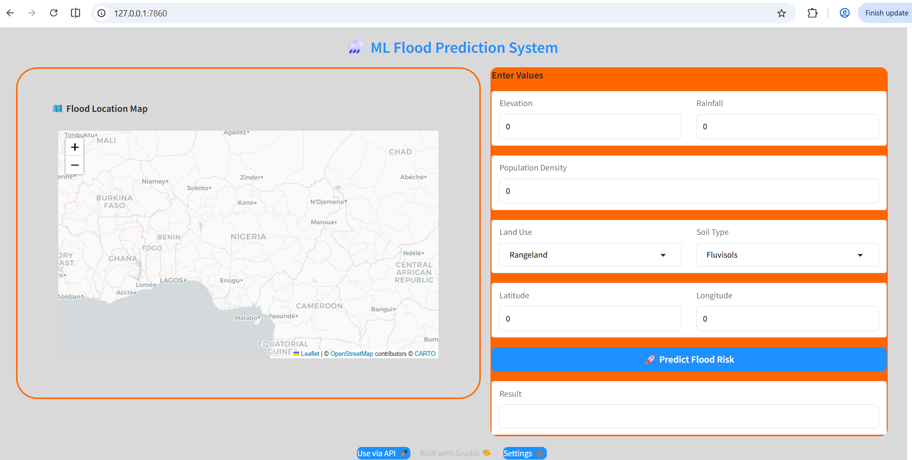

# 🌐 Floodvorhersage Webanwendung



Interaktive Webanwendung mit Machine Learning zur Vorhersage von Hochwasserrisiken mit Umwelt- und Geodaten.

---

## 📌 Projektübersicht

Dieses Projekt ist ein webbasiertes Hochwasser-Vorhersagesystem mit Python.

Die Anwendung benutzt ein trainiertes Machine-Learning-Modell aus:

[Model Training Repository](URL_HERE)

Das beste Modell ist der Random-Forest-Klassifikator. Das Modell ist hier gespeichert:

```text
model_pkl/RandomForest_model.pkl
```

Die Anwendung verbindet das trainierte Machine-Learning-Modell mit einer einfachen Weboberfläche. Benutzer können Umweltdaten eingeben und sofort eine Hochwasser-Vorhersage bekommen.

Das Projekt zeigt praktische Erfahrung in:

- Machine-Learning-Deployment
- Backend-Webentwicklung
- Modellintegration
- Lokales Deployment und Testen
- Entwicklung von Benutzeroberflächen

---

## 🛠️ Verwendete Technologien

- Python
- Gradio
- Scikit-learn
- Folium
- Pandas
- NumPy

---

## 🧠 Wie funktioniert die Anwendung?

1. Der Benutzer gibt Umweltdaten ein  
2. Der Benutzer klickt auf **Predict Flood Risk**  
3. Die Website verarbeitet die Eingaben  
4. Das Machine-Learning-Modell analysiert die Daten  
5. Das Ergebnis wird sofort angezeigt  
6. Der Ort wird auf der Karte gezeigt  

---

## 🚀 Lokal ausführen

```bash
git clone <repo-url>
cd flood-prediction-webapp
pip install -r requirements.txt
python app.py
```

## 🖥️ Vorschau der Anwendung



---

---
